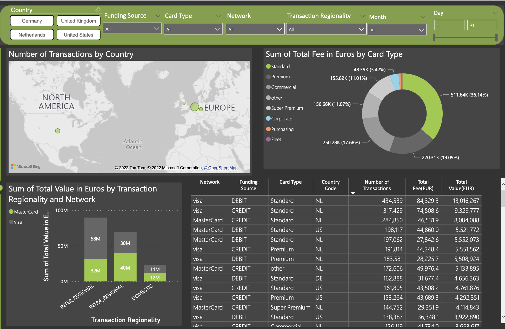
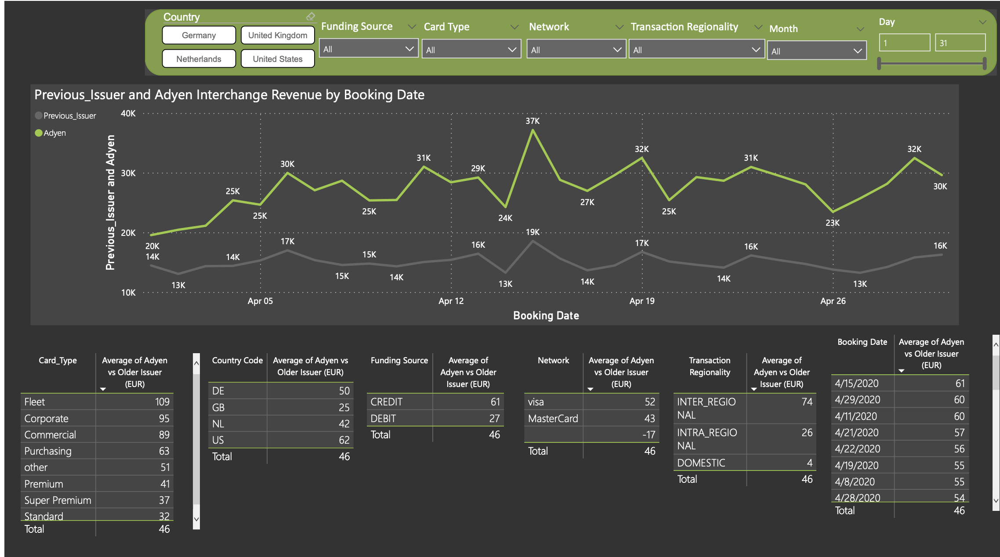

# Payment Transaction Analytics — Power BI

An interactive Power BI dashboard analysing payment transaction data across countries, card networks, card types, and transaction regionality. Built to support business teams in understanding revenue distribution, fee structures, and interchange performance.

---

## Business Questions Answered

- Which countries and networks generate the most transaction volume?
- How is total fee revenue distributed across card types?
- Which transaction regionality (domestic vs inter-regional) drives the most value?
- How does Adyen interchange revenue compare to previous issuer rates over time?
- Which card type segments offer the highest interchange advantage?

---

## Dashboard Screenshots

### Overview — Transaction Volume & Fee Distribution

*Interactive filters: Country, Funding Source, Card Type, Network, Transaction Regionality, Month, Day*

Key visuals:
- **Map** — Number of transactions by country (NL, DE, GB, US)
- **Donut chart** — Total fee in EUR by card type (Standard leads at 36%)
- **Bar chart** — Total transaction value by regionality and network
- **Detail table** — Breakdown by network, funding source, card type, and country

---

### Interchange Analysis — Adyen vs Previous Issuer

Key visuals:
- **Line chart** — Daily Adyen vs Previous Issuer interchange revenue across April
- **Summary tables** — Average interchange advantage by card type, country, funding source, network, and regionality

**Key insight:** Adyen consistently outperforms previous issuer rates across all segments, with Fleet cards showing the highest advantage (109 EUR avg vs Standard at 32 EUR avg).

---

## Dataset

Mock dataset generated to match realistic payment transaction patterns.

| Field | Description |
|---|---|
| `booking_date` | Transaction date (April 2020) |
| `country_code` | NL, DE, GB, US |
| `network` | Visa, MasterCard |
| `funding_source` | DEBIT, CREDIT |
| `card_type` | Standard, Premium, Commercial, Super Premium, etc. |
| `transaction_regionality` | INTER_REGIONAL, INTRA_REGIONAL, DOMESTIC |
| `total_value_eur` | Transaction value in EUR |
| `total_fee_eur` | Total fee charged |
| `adyen_interchange_eur` | Adyen interchange revenue |
| `previous_issuer_eur` | Previous issuer interchange revenue |

**50,000 rows** · April 2020 · 4 countries · 2 networks · 8 card types

---

## Tools

- **Power BI Desktop** — dashboard development, interactive filters
- **DAX** — calculated measures and KPIs
- **Python (pandas)** — mock data generation
