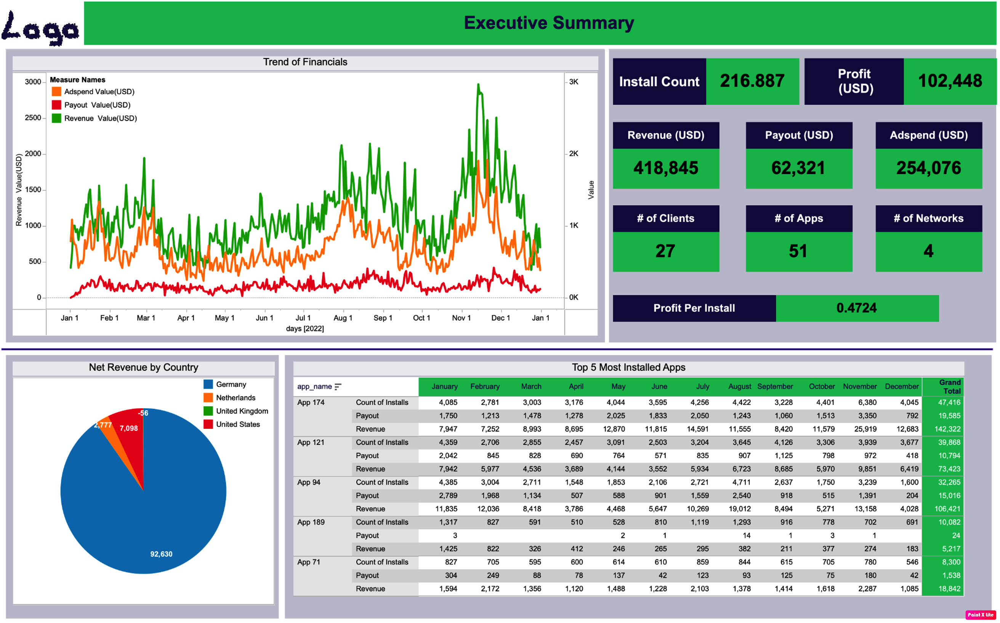

# Mobile App Performance — Tableau

An executive summary dashboard built in Tableau analysing mobile app performance across installs, revenue, adspend, and profitability. Designed to give leadership a clear picture of financial performance across apps, networks, and countries throughout 2022.

---

## Business Questions Answered

- What is the overall financial performance across all apps and networks?
- Which apps generate the most installs and revenue?
- How does revenue trend over time — are there seasonal patterns?
- Which country drives the most net revenue?
- How does profit per install vary across the portfolio?

---

## Dashboard Screenshot

### Executive Summary

---

## Key Metrics (2022)

| Metric | Value |
|---|---|
| Total Installs | 216,887 |
| Total Revenue | $418,845 |
| Total Adspend | $254,076 |
| Total Payout | $62,321 |
| Total Profit | $102,448 |
| Profit Per Install | $0.47 |
| Number of Apps | 51 |
| Number of Clients | 27 |
| Number of Networks | 4 |

---

## Key Insights

- **Revenue peaks** in November-December, suggesting strong seasonal effect
- **Netherlands dominates** net revenue at 92,630 — far ahead of other markets
- **App 174** leads in both installs (47,416) and revenue ($142,322) over the year
- **Adspend efficiency** varies significantly across apps — some apps generate strong returns, others run near break-even
- **Profit per install** of $0.47 provides a clear benchmark for evaluating new app additions

---

## Dataset

Mock dataset generated to match realistic mobile app performance metrics.

| Field | Description |
|---|---|
| `date` | Daily date (full year 2022) |
| `app_name` | App identifier (51 apps) |
| `network` | Ad network (4 networks) |
| `country` | Germany, Netherlands, United Kingdom, United States |
| `client` | Client identifier (27 clients) |
| `installs` | Number of app installs |
| `revenue_usd` | Revenue generated in USD |
| `adspend_usd` | Advertising spend in USD |
| `payout_usd` | Publisher payout in USD |
| `profit_usd` | Net profit (revenue - adspend - payout) |

**219,000 rows** · Full year 2022 · 51 apps · 27 clients · 4 networks

---

## Tools

- **Tableau Desktop** — dashboard development and visualisation
- **Python (pandas)** — mock data generation
